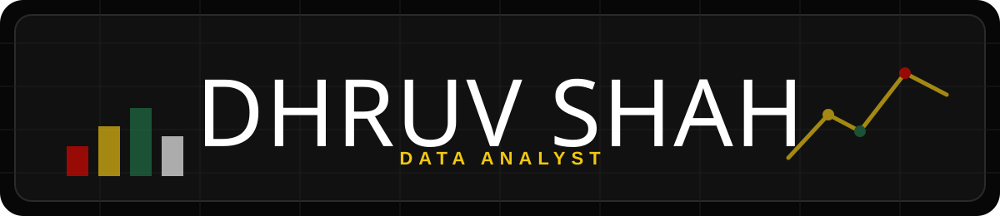
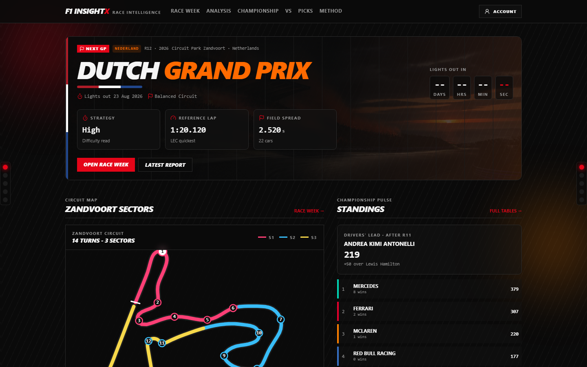

  

  

<h2 align="center">Data Analyst | Open Source Contributor</h2>

  
  
  
  
  
  

  
  
  

 

<h2 align="center">F1-InsightX</h2>

<table>
  <tr>
    <td width="58%" valign="top">
      
    </td>
    <td width="42%" valign="top">

### Formula 1 Analytics Dashboard

F1 InsightX turns race-week signals, standings, session context, and performance patterns into a decision-focused analytics experience.

It is built around data insight: compare race conditions, understand driver and constructor movement, evaluate strategy context, and make Formula 1 data easier to explore.

**Data focus:** `analytics` `dashboards` `strategy simulation` `performance comparison` `decision support`

  
  

    </td>
  </tr>
</table>

 

<h2 align="center">Contributions</h2>

<table>
  <tr>
    <td align="center" width="33%">
      
       
      BI, dashboards, and data exploration.
    </td>
    <td align="center" width="33%">
      
       
      Postgres-backed data platforms.
    </td>
    <td align="center" width="33%">
      
       
      Analytics database documentation.
    </td>
  </tr>
  <tr>
    <td align="center" width="33%">
      
       
      SQL workspaces and notebooks.
    </td>
    <td align="center" width="33%">
      
       
      Open-source contribution workflow.
    </td>
    <td align="center" width="33%">
      
       
      Learning platform contribution.
    </td>
  </tr>
</table>

  

