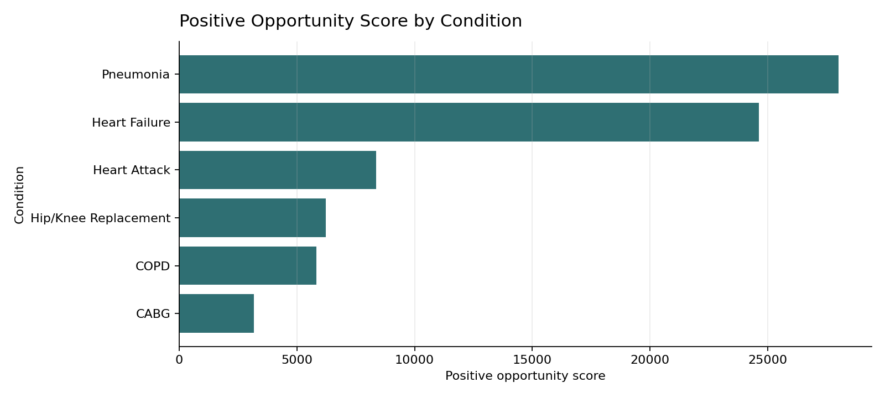
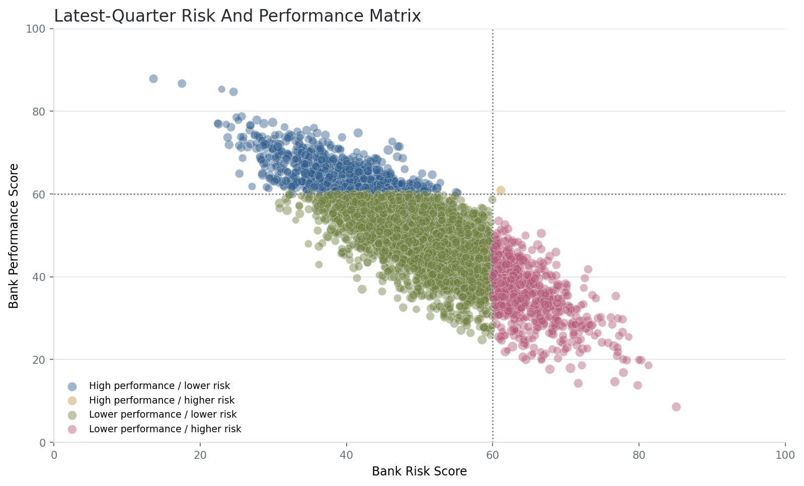
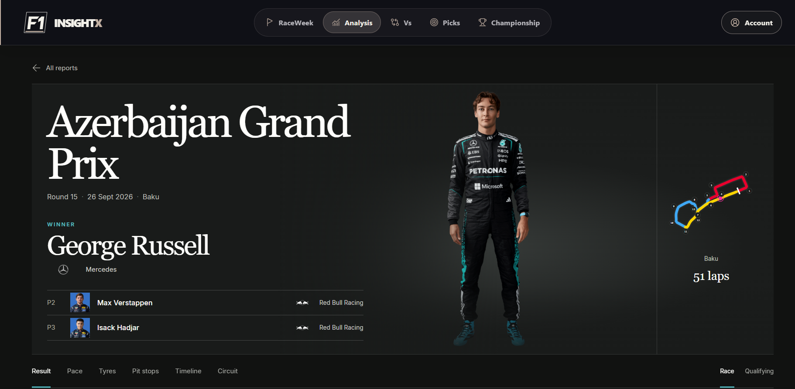

  

<h1 align="center">Dhruv Shah · Data Analyst</h1>

  I clean and connect messy data, test what the numbers mean, and build reporting that helps people make decisions.

  <strong>SQL · Python · Excel · Power BI · PostgreSQL · Streamlit</strong>

  <a href="./Data_Analyst_Resume_Dhruv_Shah.pdf"><strong>Data Analyst resume</strong></a>
  &nbsp;·&nbsp;
  <a href="./BI_Resume_Dhruv_Shah.pdf">Business Intelligence resume</a>
  &nbsp;·&nbsp;
  <a href="https://www.linkedin.com/in/dhruvshah-ai/">LinkedIn</a>
  &nbsp;·&nbsp;
  <a href="mailto:dhruv.shah.ai@gmail.com">Email</a>

## What I work on

- **Analysis:** SQL queries, Python and Pandas, data cleaning, validation, statistical analysis, and investigation of trends and outliers.
- **Reporting:** Excel KPI reports, executive workbooks, dashboards, metric definitions, and clear explanations of findings.
- **Data foundations:** ETL, reconciliation, dimensional modeling, and reproducible analytical datasets.

My experience spans operational reporting at R&P Consultants, WHO data analysis at Global Health Impact, and research data workflows at Binghamton University. The projects below show the methods and deliverables in more detail.

## Selected data analysis projects

### 01 · CMS Hospital Readmissions

**Question:** Where are the strongest opportunities to reduce 30-day hospital readmissions?

Analyzed **11,720 hospital-condition records** from CMS data. Built a cleaned dataset, reusable SQL views, statistical comparisons, and an opportunity score that combines excess readmission performance with patient volume. Deliverables include a Streamlit dashboard and an Excel executive workbook.

**Methods:** SQL · Python · Pandas · SciPy · Excel · Streamlit

[Explore the analysis and dashboard code](https://github.com/DhruvShah-Dev/cms-hospital-readmissions-analysis)

  

### 02 · U.S. Banking Risk

**Question:** How do credit, funding, capital, profitability, and interest-rate trends shape bank risk?

Built a reproducible FDIC and FRED analysis pipeline and a peer-relative risk framework. Used SQL and Python to compare institutions, identify watchlist candidates, and explain risk and performance trends. Deliverables include a Streamlit dashboard and an Excel analysis workbook. The score is a research triage measure, not a regulatory rating.

**Methods:** SQL · Python · DuckDB · FDIC · FRED · Excel · Streamlit

[Explore the risk framework and reports](https://github.com/DhruvShah-Dev/us-banking-risk-analysis)

  

### 03 · F1 InsightX

**Question:** How can race, lap, stint, and telemetry data become useful race-week analysis?

An interactive Formula 1 product with race reports, driver comparisons, strategy views, and championship analysis. Its data pipeline validates source inputs and builds product views from race results, session context, timing, and telemetry.

**Methods:** Python data pipeline · TypeScript · React · Supabase · Data visualization

[Open the live app](https://www.f1insightx.live/) · [Explore the source](https://github.com/DhruvShah-Dev/f1-insightx)

  

## Open-source data tooling

- [Tabularis](https://github.com/TabularisDB/tabularis/pulls?q=is%3Apr+author%3ADhruvShah-Dev+is%3Amerged) — SQL workspace and database interface contributions.
- [DuckDB Web](https://github.com/duckdb/duckdb-web/pulls?q=is%3Apr+author%3ADhruvShah-Dev+is%3Amerged) — documentation fixes for SQL behavior and configuration.
- [BeliefState](https://github.com/AltioraLabs/beliefstate/pull/53) — a DuckDB store backend for durable local state.

## Connect

I am open to Data Analyst, Reporting Analyst, and Business Intelligence Analyst roles. I am based in Binghamton, NY and open to relocating.

**[Download my Data Analyst resume](./Data_Analyst_Resume_Dhruv_Shah.pdf)** · [BI resume](./BI_Resume_Dhruv_Shah.pdf) · [LinkedIn](https://www.linkedin.com/in/dhruvshah-ai/) · [Email](mailto:dhruv.shah.ai@gmail.com)
